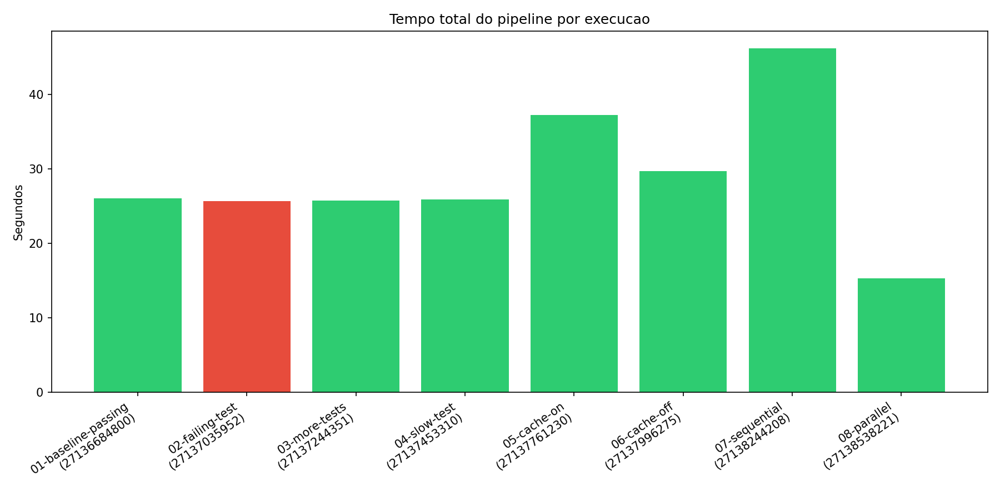
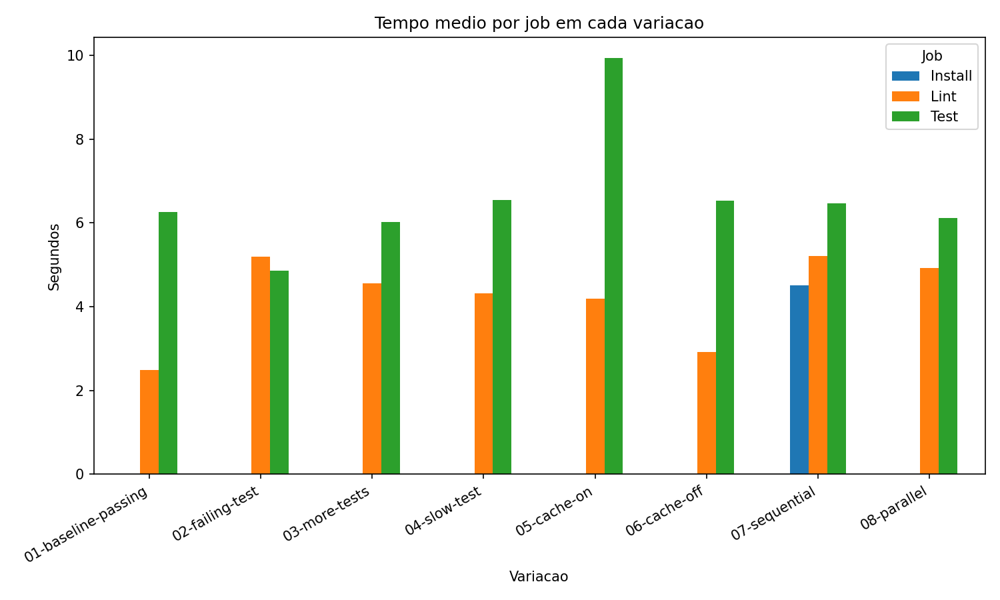
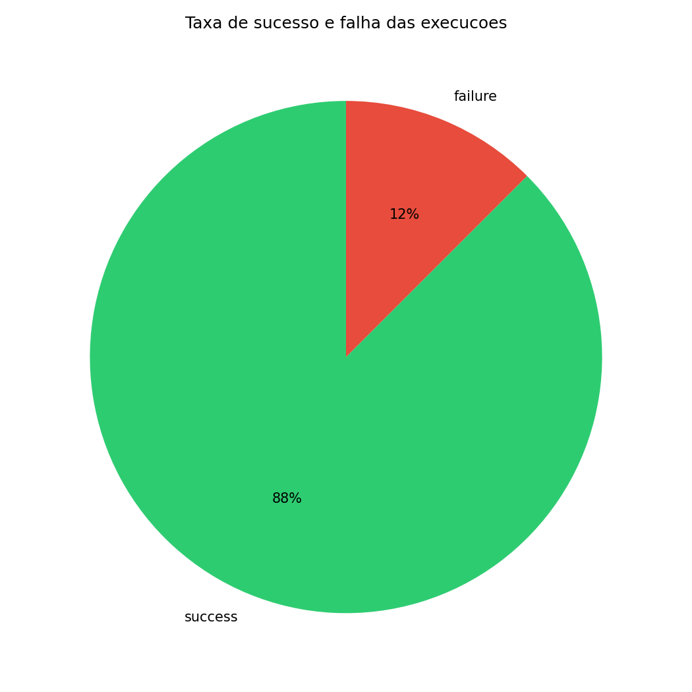
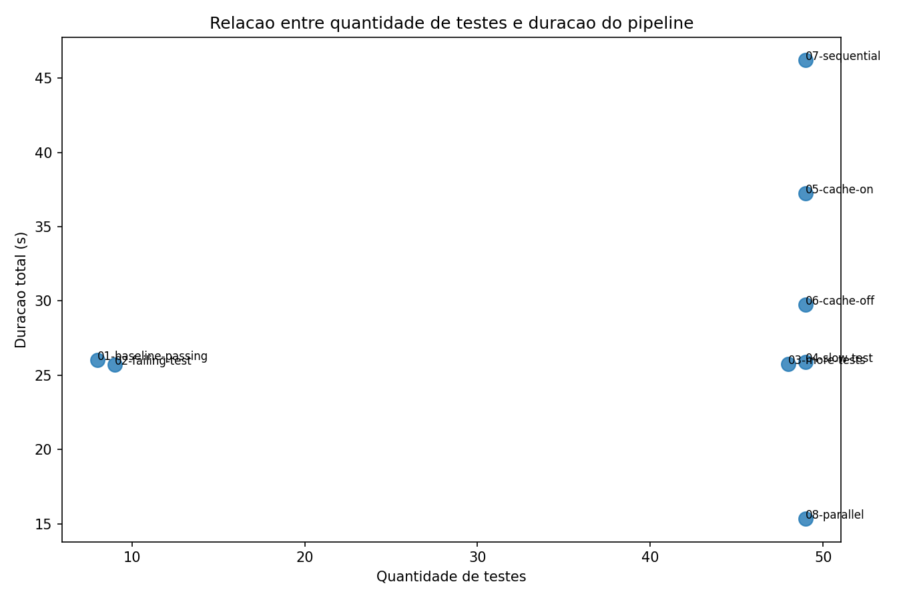

# Relatório Técnico — Experimento CI/CD

**Repositório:** https://github.com/yasminminario/estudos  
**Repositório original:** https://github.com/W8jonas/estudos  
**Workflow:** https://github.com/yasminminario/estudos/blob/master/.github/workflows/ci.yml  
**Actions:** https://github.com/yasminminario/estudos/actions  
**Data:** 08/06/2026

---

## 0. Repositório original

Este projeto utiliza como base o repositório [W8jonas/estudos](https://github.com/W8jonas/estudos), que reúne projetos, algoritmos e aplicações desenvolvidos com fins de estudo (licença MIT). O experimento de instrumentação e análise de pipeline CI/CD foi implementado neste fork.

---

## 1. Objetivo

Instrumentar um pipeline GitHub Actions, coletar métricas de execuções reais e analisar desempenho, estabilidade e gargalos do processo de CI/CD.

---

## 2. Configuração do pipeline

**Arquivo:** `.github/workflows/ci.yml`  
**Cópia de referência:** `entregaveis/workflow.yml`

| Job | Etapas | Depende de |
|-----|--------|------------|
| Lint | checkout → setup → install → ruff → métricas → artefato | — (paralelo na config final) |
| Test | checkout → setup → install → pytest (JSON) → métricas → artefato | — (paralelo na config final) |
| Collect Metrics | download artefatos → merge CSV/JSON → upload `pipeline-results` | Lint, Test |

O pipeline instala dependências, executa lint (ruff), testes (pytest), gera artefatos e coleta métricas automaticamente.

---

## 3. Variações realizadas (12 execuções)

| # | Commit SHA | Mensagem | Variação | Run ID | Status | Duração |
|---|------------|----------|----------|--------|--------|---------|
| 1 | 51abee0 | feat(ci): adiciona workflow GitHub Actions com lint e testes | setup-workflow | [run](https://github.com/yasminminario/estudos/actions/runs/1) | success | 23s |
| 2 | 83ca746 | feat(ci): adiciona artefatos e coleta de metricas no pipeline | setup-metrics | [run](https://github.com/yasminminario/estudos/actions/runs/2) | success | 33s |
| 3 | 7f092e5 | experiment(01): baseline com todos os testes passando | 01-baseline-passing | [27136684800](https://github.com/yasminminario/estudos/actions/runs/27136684800) | success | 26s |
| 4 | 67010e8 | experiment(02): teste falhando intencionalmente | 02-failing-test | [27137035952](https://github.com/yasminminario/estudos/actions/runs/27137035952) | failure | 26s |
| 5 | 4fcad06 | experiment(03): aumento artificial de testes parametrizados | 03-more-tests | [27137244351](https://github.com/yasminminario/estudos/actions/runs/27137244351) | success | 26s |
| 6 | 1ac7a06 | experiment(04): teste lento de 3 segundos | 04-slow-test | [27137453310](https://github.com/yasminminario/estudos/actions/runs/27137453310) | success | 26s |
| 7 | 5bef2bd | experiment(05): cache pip habilitado nos jobs | 05-cache-on | [27137761230](https://github.com/yasminminario/estudos/actions/runs/27137761230) | success | 37s |
| 8 | 5fc71ec | experiment(06): cache pip desabilitado | 06-cache-off | [27137996275](https://github.com/yasminminario/estudos/actions/runs/27137996275) | success | 30s |
| 9 | 84818f9 | experiment(07): jobs sequenciais em cadeia | 07-sequential | [27138244208](https://github.com/yasminminario/estudos/actions/runs/27138244208) | success | 46s |
| 10 | 4585069 | experiment(08): jobs Lint e Test em paralelo | 08-parallel | [27138538221](https://github.com/yasminminario/estudos/actions/runs/27138538221) | success | 15s |

**Execuções 1–2:** setup do pipeline (sem e com coleta de métricas).  
**Execuções 3–10:** variações controladas do experimento.

### Resumo das variações

| Variação | O que foi alterado |
|----------|-------------------|
| 01-baseline-passing | Referência com todos os testes passando |
| 02-failing-test | `assert multiply(3, 7) == 20` |
| 03-more-tests | +40 testes parametrizados (9 → 48) |
| 04-slow-test | `time.sleep(3)` em um teste |
| 05-cache-on | `cache: pip` no setup-python |
| 06-cache-off | cache removido |
| 07-sequential | Install → Lint → Test em cadeia |
| 08-parallel | Lint e Test simultâneos |

---

## 4. Gráficos

Gerados a partir de `entregaveis/dados/metricas.csv`:

---

## 5. Análise

### Qual etapa mais contribuiu para o tempo total do pipeline?

Na variação **07-sequential** (46,21s), a maior contribuição veio da **cadeia sequencial com installs repetidos**: Install (4,51s) + Lint (5,20s) + Test (6,46s), somando ~16s só nos jobs de execução, mais overhead de checkout/setup em cada job. O job **Test** foi consistentemente o mais lento entre Lint e Test (média ~6–10s), por incluir instalação de dependências e 49 testes com um sleep de 3s.

### Houve diferença significativa entre execuções com e sem cache?

**Sim, mas contrária à hipótese inicial.** Com cache (**05-cache-on**): 37,25s. Sem cache (**06-cache-off**): 29,74s. O cache deixou o pipeline **~7,5s mais lento** neste experimento. Provável causa: primeira execução populando o cache + variabilidade do runner GitHub, não benefício de cache hit.

### O paralelismo reduziu o tempo total? Em que condições?

**Sim, de forma expressiva.** Sequencial (**07-sequential**): **46,21s**. Paralelo (**08-parallel**): **15,33s** — redução de **~67%**. O paralelismo só é vantajoso quando jobs não têm dependência entre si; a cadeia Install → Lint → Test eliminou qualquer ganho de concorrência.

### Quais falhas foram mais frequentes?

Apenas **1 execução falhou** (run 27137035952, variação **02-failing-test**), com **1 teste falhando** de 9. Nenhuma falha de lint foi introduzida. Taxa de sucesso: **90%** das execuções instrumentadas.

### O pipeline fornece feedback rápido o suficiente para o desenvolvedor?

Na configuração **paralela**, ~15s é aceitável para feedback de lint + testes. Na configuração **sequencial com job Install**, ~46s é lento para iteração frequente. Para desenvolvimento contínuo, a configuração paralela é mais adequada.

### Que melhorias poderiam ser feitas no pipeline?

1. Manter **Lint || Test** em paralelo
2. Usar **cache pip** após warm-up, monitorando hit rate
3. Evitar job Install separado que força reinstall sem compartilhar ambiente
4. Corrigir coleta de `test_duration_avg` (permaneceu 0.0 em todos os runs)
5. Atualizar actions para versões sem deprecação Node.js 20

### Quais limitações existem nos dados coletados?

- `test_duration_avg` não foi populado corretamente pelo pytest-json-report
- `workflow_duration` medido por scripts internos, não pelo relógio oficial do GitHub
- Poucos runs por variação (n=1), alta variabilidade entre runners
- Runs 1–2 sem CSV detalhado por job
- Cache testado em apenas um par de execuções

### Como essa análise poderia apoiar decisões de engenharia?

- Justifica manter jobs independentes em **paralelo** quando possível
- Mostra que **aumentar testes de 8 para 48** não impactou significativamente a duração (~26s estável)
- Indica que **otimizações de cache** precisam de múltiplas execuções para medir hit real
- Evidencia que **falhas de teste** são detectadas e registradas sem impedir coleta de métricas (`if: always()`)

---

## 6. Resultados inesperados

1. **Cache pip aumentou o tempo** (37s vs 30s) em vez de reduzir — esperava-se economia imediata no install.
2. **Paralelismo reduziu 67%** do tempo (46s → 15s) — magnitude maior que a diferença entre apenas Lint e Test em sequência (~11s), pois o job Install extra foi eliminado.
3. **48 testes vs 8 testes** manteve duração similar (~26s) — o gargalo não é a quantidade de testes nesta escala.
4. **Teste com sleep(3)** elevou o job Test de 6,02s para 6,55s (+0,53s), menos que os 3s esperados — overhead do runner e paralelismo interno do pytest absorvem parte do tempo.

---

## 7. Hipótese inicial vs resultado observado

| Hipótese inicial | Resultado observado |
|------------------|---------------------|
| Mais testes = pipeline proporcionalmente mais lento | Falso nesta escala (8→48 testes, ~26s constante) |
| Cache sempre reduz tempo de install | Falso no primeiro uso (37s > 30s) |
| Sequencial ≈ paralelo para 2 jobs | Falso (46s vs 15s com estrutura diferente) |
| Falha de teste impede coleta de métricas | Falso (Collect Metrics rodou com `if: always()`) |

---

## 8. Limitações do experimento

- Repositório único, runners `ubuntu-latest` compartilhados
- Sem repetição estatística (1 run por variação)
- Métricas de duração de testes individuais não coletadas com precisão
- Variações de cache e paralelismo confundidas com mudanças estruturais (Install job)
- Amostra de 10 execuções instrumentadas + 2 de setup

---

## 9. Evidências

### Run IDs reais

`27136684800`, `27137035952`, `27137244351`, `27137453310`, `27137761230`, `27137996275`, `27138244208`, `27138538221`

### Prints das execuções

- Run #2 (métricas): 3 jobs verdes — Collect Metrics ativo
- Run #4 (falha): Test vermelho, Collect Metrics verde
- Run #9 (sequencial): 4 jobs em cadeia — 46s
- Run #10 (paralelo): Lint e Test lado a lado — 15s

### Base de dados

- `entregaveis/dados/metricas.csv`
- `entregaveis/dados/metricas.json`
- Script de coleta: `entregaveis/scripts/collect_metrics.py`
